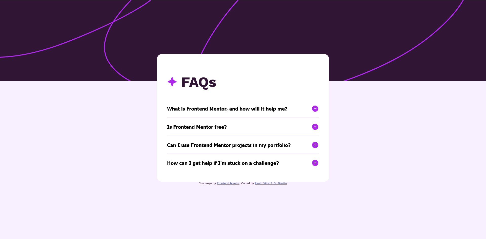

# Frontend Mentor - FAQ accordion solution

This is a solution to the [FAQ accordion challenge on Frontend Mentor](https://www.frontendmentor.io/challenges/faq-accordion-wyfFdeBwBz). Frontend Mentor challenges help you improve your coding skills by building realistic projects. 

## Table of contents

- [Overview](#overview)
  - [The challenge](#the-challenge)
  - [Screenshot](#screenshot)
  - [Links](#links)
- [My process](#my-process)
  - [Built with](#built-with)
  - [What I learned](#what-i-learned)
  - [Continued development](#continued-development)
  - [Useful resources](#useful-resources)
- [Author](#author)

**Note: Delete this note and update the table of contents based on what sections you keep.**

## Overview

### The challenge

Users should be able to:

- Hide/Show the answer to a question when the question is clicked
- Navigate the questions and hide/show answers using keyboard navigation alone
- View the optimal layout for the interface depending on their device's screen size
- See hover and focus states for all interactive elements on the page

### Screenshot

### Links

- Solution URL: https://www.frontendmentor.io/solutions/accessible-accordion-with-pure-javascript-NXqFb4lidk
- Live Site URL: https://high-rolls.github.io/faq-accordion-main/

## My process

### Built with

- Semantic HTML5 markup
- CSS custom properties
- Flexbox

### What I learned

I learned how to create accessible accordions that work with keyboard focus.

### Continued development

I wanted to try animating the accordion opening and closing, but I still don't know how to work with CSS transitions. That could be something to focus on learning next.

### Useful resources

- [Accessible Accordion by Aditus](https://www.aditus.io/patterns/accordion/) - This example served as the base structure and code for my accordion.

## Author

- Frontend Mentor - [@high-rolls](https://www.frontendmentor.io/profile/high-rolls)